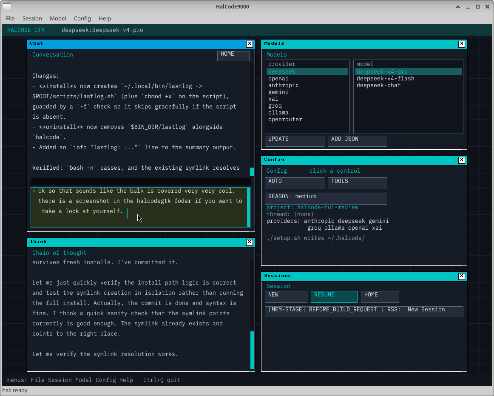

# HalCodeGTK

GTK / AppDesk front end for **HalCode9000** — the same agent, tools,
providers, and `~/.halcode` keys as the [TUI](https://github.com/AiLang-Author/HalCode9000).
Pixels come from an AILang desk (`halcode_desk.x`) plus a thin GTK blit host.

Copyright (c) 2026 Sean Collins, 2 Paws Machine and Engineering. MIT.



## Requirements

- Linux desktop (X11)
- `cc`, `pkg-config`, GTK 3 + cairo (`libgtk-3-dev libcairo2-dev`)
- [`ailang.x`](https://github.com/AiLang-Author/Ailang-Self-Hosting-) on `PATH`
- Optional: PostgreSQL (pgmem), [OlympusRepo](https://github.com/AiLang-Author/OlympusRepo) (relmem)

Debian / Ubuntu:

```bash
sudo apt install build-essential pkg-config libgtk-3-dev libcairo2-dev
```

Set `AILANG_ROOT` to your AILang tree if it is not `~/Ailang-Self-Hosting-`.

## Install

```bash
git clone https://github.com/AiLang-Author/HalCodeGTK.git
cd HalCodeGTK
chmod +x install.sh
./install.sh
```

That builds the agent, GTK host, and desk; registers **HalCode9000** in the
Applications menu; links `~/.local/bin/halcode` and `~/.local/bin/lastlog`;
and runs `setup.sh` for API keys / pgmem.

```bash
./install.sh --skip-keys --skip-postgres --skip-olympus
./install.sh --no-build          # menu entry only
./scripts/install_desktop.sh --uninstall
```

## Run

```bash
halcode
# or
./scripts/launch_halcode.sh
```

Does **not** touch leftover `HalCode9000.x --mcp` processes.

## Build

```bash
./build.sh                          # agent + tools
./build.sh --no-tools               # main binary only (fast iteration)
./build.sh --self-update            # rebuild, swap binaries, restart the app
./build.sh --self-update --dry-run  # print the stop/restart plan only
```

Compiles land in `/tmp` first and are copied to the project root only after
every build succeeds. `--self-update` stops the running desk/shell and its
`--host`/`--agent` children, swaps the binaries, and relaunches; long-lived
`--mcp` servers are left alone.

## Verify

```bash
./verify.sh                 # fast-compile both HalCode trees
./verify.sh --grep SYMBOL   # grep both trees for SYMBOL
./verify.sh SYMBOL          # grep both trees, then fast-compile both
./verify.sh --full          # full build (tools + main) of both trees
```

`verify.sh` checks this tree and the canonical AILang source tree (resolved
from `ailang.x` / `~/HalCode9000`); compiles use `--no-copy`, so nothing is
installed.

## Logs

```bash
lastlog           # path + tail the newest session log
lastlog -p        # path only
lastlog -f        # follow the newest log
lastlog -n 200    # last 200 lines
```

`lastlog` (linked into `~/.local/bin` by the installer) prints the newest of
`~/.halcode/logs/session_*.txt` (headless/TUI) or `~/.halcode/chat*.ndjson`
(live GTK chat).

## Config

| Path | Purpose |
|---|---|
| `~/.halcode/keys.env` | API keys (from `setup.sh`) |
| `~/.halcode/system_prompt.txt` | editable system prompt |
| `~/.halcode/halcode.json` | `max_tokens` and friends |
| `~/.halcode/providers/` | extra provider JSON |

Rebuild in place after source edits:

```bash
make
halcode
```

## Layout

| Path | Role |
|---|---|
| `HalCode9000.ailang` / `.x` | agent (`--host`, `--agent`, `--mcp`) |
| `shell/halcode_desk.ailang` | AppDesk MDI, chat, wrap, copy |
| `shell/halcode_shell_gtk.c` | native window, clipboard, blit |
| `cc_tools/` | tool workers |
| `config/system_prompt.txt` | shipped default prompt |
| `fonts/` | IBM Plex Mono VIF |
| `verify.sh` | one-shot grep + build across both trees |
| `scripts/lastlog.sh` | print/follow the newest session log |

The TUI lives in a separate repo. This tree’s `UI.ailang` is a headless stub
so the agent still compiles.
